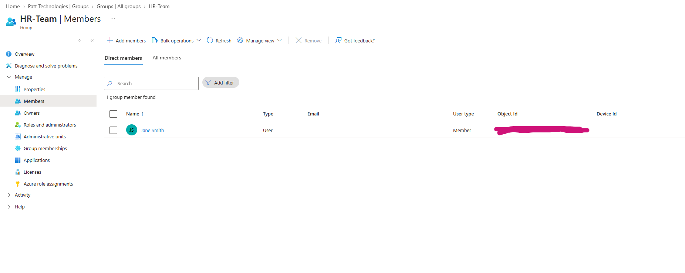
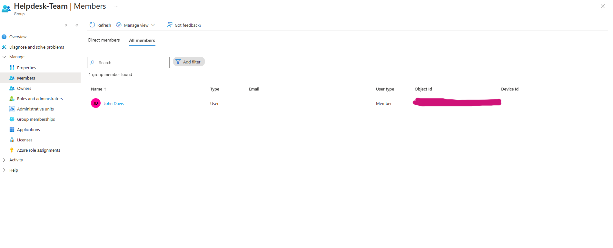
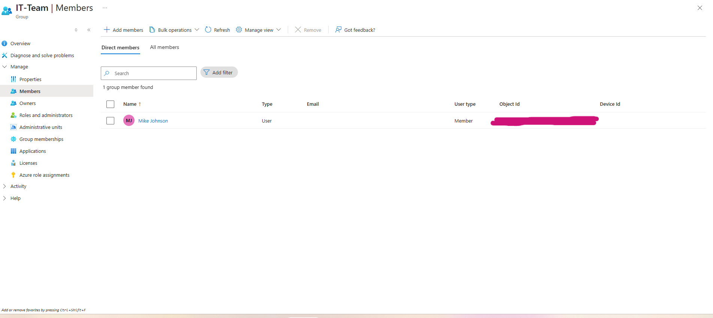
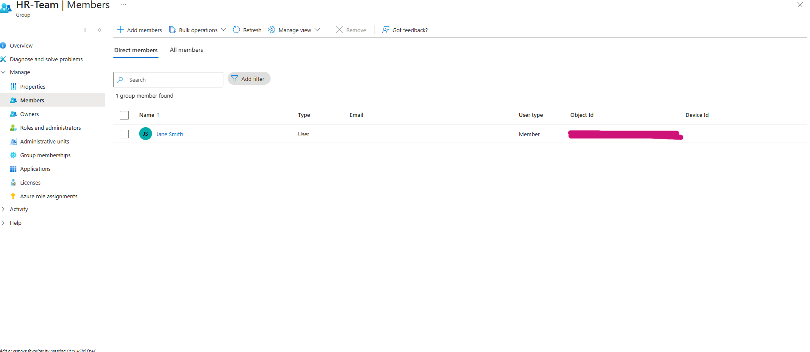
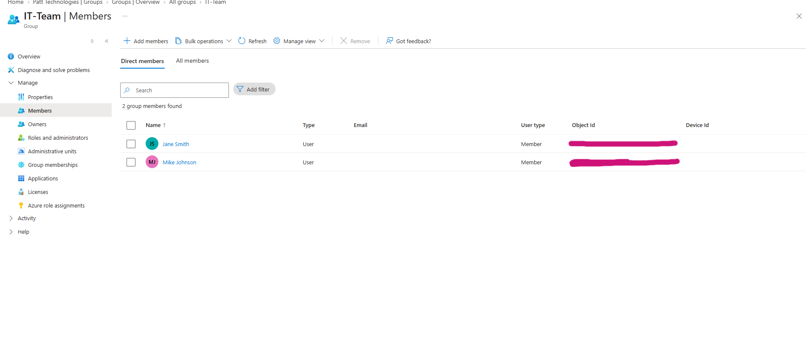
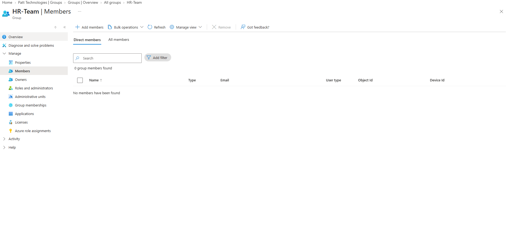
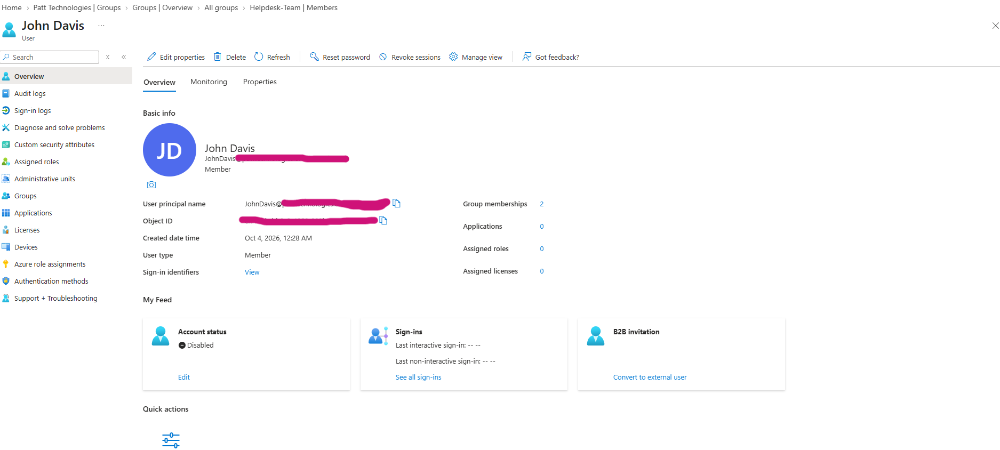
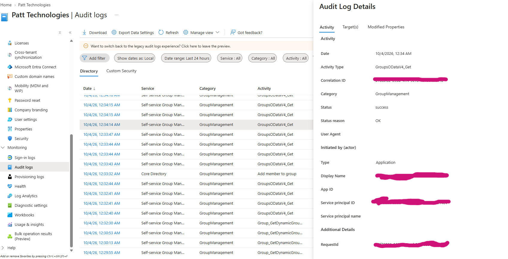

# Entra ID User Lifecycle & Access Management Lab

## Project Overview

This lab simulates a real-world Identity and Access Management (IAM) user lifecycle using Microsoft Entra ID. The lab demonstrates how user access can be managed throughout the employee lifecycle, including onboarding, group-based access assignment, department transfers, access changes, and offboarding.

## Objectives

* Create and manage user identities in Microsoft Entra ID
* Use security groups to manage role-based access
* Simulate employee onboarding and access assignment
* Simulate an employee department transfer
* Modify group membership based on a role change
* Disable a user account during offboarding
* Review audit logs to verify IAM activities
* Demonstrate the Joiner-Mover-Leaver (JML) lifecycle

## Tools Used

* Microsoft Entra ID
* Microsoft Entra ID Security Groups
* Microsoft Entra ID Audit Logs
* Role-Based Access Control (RBAC)
* GitHub

## User Lifecycle Scenario

The lab simulates the following employee lifecycle:

**Joiner → Access Assignment → Mover → Access Change → Leaver → Account Disabled**

---

## Screenshots

### Entra ID Groups Overview

This screenshot shows the security groups created for the IAM lab, including HR-Team, Helpdesk-Team, and IT-Team.

### HR Team Membership

Jane Smith is assigned to the HR-Team security group.

### Help Desk Team Membership

John Davis is assigned to the Helpdesk-Team security group.

### IT Team Membership

Mike Johnson is assigned to the IT-Team security group.

### Employee Transfer — Before

Jane Smith's original access is shown before her simulated department transfer.

### Employee Transfer — After

Jane Smith's group membership is updated to reflect her new department.

### Mover / Access Change

This screenshot documents the access change associated with the employee's simulated role or department transition.

### Leaver / Account Disabled

The employee account is disabled as part of the simulated offboarding process.

### Audit Log

Microsoft Entra ID audit logs were reviewed to verify identity and access management activities performed during the lab.

---

## IAM Concepts Demonstrated

* User provisioning
* Group-based access management
* Role/department-based access
* Access modification
* User deprovisioning
* Account disabling
* Joiner-Mover-Leaver (JML)
* Audit and access verification
* Identity lifecycle management

## Lab Outcome

This lab demonstrates practical experience managing user identities and access throughout the employee lifecycle using Microsoft Entra ID. It provides a hands-on example of IAM concepts including provisioning, access changes, deprovisioning, and audit verification.
